<!-- _class: top -->
# Simplest Vulkan Tutorial

## 天狗(Tengu712)

---

<!-- _class: section -->
# はじめに

---

# コンセプト

**網羅率を代償に、正しさを持って、簡単に速習すること。**

他のチュートリアルでは軽視されがちな「理論」の部分に重点を置く。
読みやすく、わかりやすく、試しやすい、を意識している。

当スライドを見てもプログラムは組めない。
当スライドを見て、プログラムを俯瞰できるようにしてほしい。

---

# 想定の対象者層

次の程度のリテラシーは欲しい：

* C言語が読める
* 行列の積が分かる
* コンピュータアーキテクチャが少し分かる

---

# サンプルコード

本スライドには断片的にしか掲載しない。適宜以下のリンクを参照してほしい。
https://github.com/Tengu712/Vulkan-Tutorial

尚、**独特**なコーディング規則について、以下のよう：

* 列数に上限なし
* ifの分岐後命令が一つなら中括弧なし
* ifの分岐後命令が一つかつbreak、continue、returnなら改行
* 構造体の実体は初期化子で初期化
* 初期化子内は余程短くない限り改行
* 必要以上に関数・モジュール分割しない

---

# 参考文献

どのくらい参考したかはともかく、ぼくがVulkanを勉強する上で参考にした公式文献を除く文献：

* すらりん『Vulkan Programming Vol.1』
* Fadis『3DグラフィクスAPI Vulkanを出来るだけやさしく解説する本』
* きてらい「やっていくVulkan入門」
* Alexander Overvoorde「VulkanTutorial」
* vblanco20-1「VulkanGuide」

局所的には、各頁に示す。

---

# RenderDoc

グラフィックプログラミングをしていると、
「コンパイルエラーもランタイムエラーもないが映らない」
なんてことがしょっちゅうある。

RenderDocを使うと以下を確認できたりするため、利用すべき：

* カラーバッファやデプスバッファ
* 各ステートの設定
* 各シェーダの入力と出力
* デプステストの結果

https://renderdoc.org/

---

<!-- _class: section -->
# Vulkan概要

---

# Vulkanとは

**グラフィックスAPI**の一種。
OpenGLの後継。従来のAPIより低水準で自由。

---

# グラフィックスAPIとは

主に**レンダリング**を目的とした、GPUを扱うための**API**。

「なぜAPIを介すのか？」
GPUのアーキテクチャは非公開であることが多く、アセンブリを書くのが現実的でないから。

「なぜGPUを使うのか？」
現状の並列計算力を比較してCPUよりGPUの方がレンダリング処理に強いから

---

# レンダリングとは

画面に図形を描画すること。手法は色々考えられる。

主要グラフィックスAPIでは、一つの対象に対してパイプライン処理を行う。
**レンダリングパイプライン**と言う。

---

# レンダリングパイプライン

描画対象を処理する工程。多くは大雑把に以下のよう：

1. インプットアセンブラ
2. ヴァーテックスシェーダ
3. ビューポート変換
4. ラスタライゼーション
5. フラグメントシェーダ
6. 合成

---

# Vulkanのレンダリングパイプライン

概ね右の通り。

参考元：
Khronos Group, Vulkan 1.1 Quick Reference

---

# 今回扱う部分

---

# プログラマは何をすればいいか

**Vulkanに詳細な設定を与えて、Vulkanを介してGPUに計算させる。**

難しいアルゴリズムを考える必要は皆無。とにかく仕様と睨めっこ。

---

# イメージ図

---

<!-- _class: section -->
# GPUを扱うために

---

# GPUは遠隔リソース

普通GPUは、CPUと非同期に動作するデバイス。

またGPUは、PCI-Expressを介してメインメモリにアクセスできるが、
そのメモリ管理ユニットはCPUのものと異なる。

従って、**非同期処理が大前提**となる。

---

# キューとコマンド

GPUに計算をさせるためには、GPUのコマンドキューにコマンドを流す。

Vulkanにおいては、コマンドバッファにコマンドを積んでから、コマンドバッファごとキューに提出する。
コレクションの`push_all`メソッドみたいな。

提出されるなり、GPUは非同期に計算を始める。

---

# 同期の取り方

CPU-GPU間

* フェンスを用いる。
  コマンドバッファをキューに提出する際、フェンスを指定できる。
  提出したコマンドがすべて処理されるまで`vkWaitForFences`関数でCPUを休止できる。
* `vkDeviceWaitIdle`関数を用いる。
  プロセスから提出されたすべてコマンドが処理されるまでCPUを休止できる。

GPU-GPU間

* セマフォを用いる。
  GPU-GPU間で同期を取るべき処理各所で指定する。

---

# メモリの種類

メモリには少なくとも以下の二種類がある：

* メインメモリ(RAM)：CPUが扱うのに適したメモリ
* デバイスメモリ(VRAM)：GPUが扱うのに適した、CPUが扱えないメモリ

GPUからメインメモリ上のデータを扱うためには、
PCI-Expressを介すため、デバイスメモリ上のデータを扱うより遅い。

GPUしか扱わない・初期化後に更新しないデータは、デバイスメモリに格納するのが良い。

---

# デバイスメモリ

CPUはデバイスメモリを直接扱えないため、
CPUからデバイスメモリ上にデータを格納する場合は、以下の手順を踏む：

1. デバイスメモリを確保する
1. メインメモリにステージングバッファを確保する
1. ステージングバッファにデータを格納する
1. コピーコマンドを用いて、
   GPUにステージングバッファのデータをデバイスメモリへコピーしてもらう

---

<!-- _class: section -->
# 画面を一色にクリアする

---

# 描画の仕組み (不確定情報)

「フレームバッファ」とは、デバイスメモリ上に存在する描画表示領域。
`ディスプレイ幅xディスプレイ高xピクセルサイズ`のサイズの色情報配列。

ディスプレイのスキャンタイミングに合わせて「フレームバッファ」をディスプレイへ転送することで、ディスプレイに映像が表示される。

たぶん転送は、GPUによってCPUとは非同期的に行われる。

---

# 垂直同期 (不確定情報)

ディスプレイの走査線が右下から左上に戻るタイミング
　　　　＝　画面の更新が完了して次の更新が始まるまでのタイミング
に合わせること。

アプリが垂直同期を取らずにプレゼンテーションを行う
　　　　＝　ディスプレイへ転送中のフレームバッファに書き込みを行う

---

# スワップチェーン (不確定情報)

Vulkanを用いて「フレームバッファ」に書き込むためには、
スワップチェーンを用いる。

1. ウィンドウのサーフェス(のサイズ等)に応じたスワップチェーンを作成する
1. スワップチェーンの扱えるイメージのイメージビューを作成する
1. レンダーパスを作成する
1. レンダーパスとスワップチェーンイメージビューとを関連させた、
   フレームバッファを作成する
1. フレームバッファを介してスワップチェーンイメージへレンダリングを行う
1. *プレゼンテーションを行って「フレームバッファ」へ書き込む*

---

# レンダーパス

描画の全体の動きを制御するオブジェクト。

* どのアタッチメント(描画先イメージやデプスバッファ)を用いるか
* どの順番でどう描画するか

レンダリングパイプライン等の具体的な描画工程は示さない。

レンダーパスを開始するとき、アタッチメントをクリアできる。
カラーアタッチメントなら一色にクリアできる。

---

# 画面を一色にクリアする

準備：

1. サーフェス作成
1. サーフェスに応じたスワップチェーン作成
1. スワップチェーンイメージのイメージビュー作成
1. カラーアタッチメントを用いるレンダーパス作成
1. レンダーパスとスワップチェーンイメージビューを関連させた、
   フレームバッファ作成

---

# 画面を一色にクリアする

描画：

1. コマンドバッファ開始
1. レンダーパス開始
   このとき、アタッチメントの初期値(クリア色)を指定
1. レンダーパス終了
1. コマンドバッファ終了
1. コマンドバッファをキューに提出
1. プレゼンテーションコマンドをキューに追加
   *垂直同期がオンならば、垂直同期を取ってバッファに書き込まれる*
   *書き込まれる*までスレッドが休止する

---

<!-- _class: section -->
# 頂点シェーダ

---

# 頂点シェーダ

レンダリングパイプラインのステージの一つ。

主に頂点座標変換を行う。

プログラマブル。GLSLやHLSL等で記述する。
Vulkanでは、さらにSPIR-Vにコンパイルしたものを用いる。

---

# 頂点座標変換

一般的に次の順で座標系に合わせて変換していく：

1. ローカル座標系：モデル内の座標 (入力)
1. ワールド座標系：3D空間の絶対座標
1. ビュー座標系：カメラから見た座標
1. (視錘台内の座標系)：正規化される前の座標 (出力)

---

# ローカル座標

ローカル座標を以下とする：

$$
\begin{bmatrix}
  x\\
  y\\
  z\\
  1\\
\end{bmatrix}
$$

これに左から行列をかけることで変換していく。
いわゆるアフィン変換。

---

# ワールド座標変換

次の順で行うのが良い (つまり次の順で行列を右から並べる)：

1. 拡大縮小
1. 回転
1. 平行移動

---

# ワールド座標変換 (拡大縮小)

$$
\begin{bmatrix}
  s_x & 0 & 0 & 0\\
  0 & s_y & 0 & 0\\
  0 & 0 & s_z & 0\\
  0 & 0 & 0 & 1\\
\end{bmatrix}
\begin{bmatrix}
  x\\
  y\\
  z\\
  1\\
\end{bmatrix}
=
\begin{bmatrix}
  s_xx\\
  s_yy\\
  s_zz\\
  1\\
\end{bmatrix}
$$

---

# ワールド座標変換 (x軸周りの回転)

回転角を$\theta$ラジアンとして：

$$
\begin{bmatrix}
  1 & 0 & 0 & 0\\
  0 & \cos\theta & \sin\theta & 0\\
  0 & -\sin\theta & \cos\theta & 0\\
  0 & 0 & 0 & 1\\
\end{bmatrix}
\begin{bmatrix}
  x\\
  y\\
  z\\
  1\\
\end{bmatrix}
=
\begin{bmatrix}
  x\\
  \cos(\theta)y+\sin(\theta)z\\
  -\sin(\theta)y+\cos(\theta)z\\
  1\\
\end{bmatrix}
$$

---

# ワールド座標変換 (Y軸周りの回転)

回転角を$\theta$ラジアンとして：

$$
\begin{bmatrix}
  \cos\theta & 0 & -\sin\theta & 0\\
  0 & 1 & 0 & 0\\
  \sin\theta & 0 & \cos\theta & 0\\
  0 & 0 & 0 & 1\\
\end{bmatrix}
\begin{bmatrix}
  x\\
  y\\
  z\\
  1\\
\end{bmatrix}
=
\begin{bmatrix}
  \cos(\theta)x-\sin(\theta)z\\
  y\\
  \sin(\theta)x+\cos(\theta)z\\
  1\\
\end{bmatrix}
$$

---

# ワールド座標変換 (Z軸周りの回転)

回転角を$\theta$ラジアンとして：

$$
\begin{bmatrix}
  \cos\theta & \sin\theta & 0 & 0\\
  -\sin\theta & \cos\theta & 0 & 0\\
  0 & 0 & 1 & 0\\
  0 & 0 & 0 & 1\\
\end{bmatrix}
\begin{bmatrix}
  x\\
  y\\
  z\\
  1\\
\end{bmatrix}
=
\begin{bmatrix}
  \cos(\theta)x+\sin(\theta)y\\
  -\sin(\theta)x+\cos(\theta)y\\
  z\\
  1\\
\end{bmatrix}
$$

---

# ワールド座標変換 (平行移動)

$$
\begin{bmatrix}
  1 & 0 & 0 & t_x\\
  0 & 1 & 0 & t_y\\
  0 & 0 & 1 & t_z\\
  0 & 0 & 0 & 1\\
\end{bmatrix}
\begin{bmatrix}
  x\\
  y\\
  z\\
  1\\
\end{bmatrix}
=
\begin{bmatrix}
  x + t_x\\
  y + t_y\\
  z + t_z\\
  1\\
\end{bmatrix}
$$

---

# ビュー座標変換

$$V_{trs}=(平行移動行列)^{-1}$$
$$V_{rtz}=(Z軸周りの回転行列)^{-1}$$
$$V_{rty}=(Y軸周りの回転行列)^{-1}$$
$$V_{rtx}=(X軸周りの回転行列)^{-1}$$

として、ビュー座標変換行列は、

$$V_{trs}V_{rtz}V_{rty}V_{rtx}$$

---

# 射影変換 (平行投影)

遠近感をつけない。
$w$が$1$になるので、実質的にクリッピング座標系へ変換する。

幅を$width$、高さを$height$、深さを$depth$とすると、

$$
\begin{bmatrix}
  1/width & 0 & 0 & 0\\
  0 & 1/height & 0 & 0\\
  0 & 0 & 1/depth & 0\\
  0 & 0 & 0 & 1
\end{bmatrix}
\begin{bmatrix}
  x\\
  y\\
  z\\
  1\\
\end{bmatrix}
=
\begin{bmatrix}
  x/width\\
  y/height\\
  z/depth\\
  1\\
\end{bmatrix}
$$

---

# 射影変換 (透視投影)

遠近感をつける。
**$w$はビュー座標系における$z$となる。**

視野角の半分を$\theta$、アスペクト比を$aspect$、前近面のz座標を$near$、遠方面のz座標を$far$とすると、

$$
\begin{bmatrix}
  1/width & 0 & 0 & 0\\
  0 & 1/height & 0 & 0\\
  0 & 0 & 1/depth & 0\\
  0 & 0 & 0 & 1
\end{bmatrix}
\begin{bmatrix}
  x\\
  y\\
  z\\
  1\\
\end{bmatrix}
=
\begin{bmatrix}
  x/width\\
  y/height\\
  z/depth\\
  1\\
\end{bmatrix}
$$

---

<!-- _class: section -->
# Post 

---

# ビューポート変換

頂点シェーダの出力をクリッピング座標系に変換する。

$$
\frac{1}{w}
\begin{bmatrix}
  x\\
  y\\
  z\\
  w\\
\end{bmatrix}
=
\begin{bmatrix}
  x/w\\
  y/w\\
  z/w\\
  1\\
\end{bmatrix}
=
\begin{bmatrix}
  p_x\\
  p_y\\
  p_z\\
  1\\
\end{bmatrix}
$$

$p_x,p_y$がビューポート上の座標、$p_z$が深度値となる。

---

# デプステスト

---

# 透視投影行列の罠

前近面のz座標を0とすると、行列は簡単になるが、深度値が必ず1になる。

---

# ラスタライズとマルチサンプリング

---

<!-- _class: section -->
# フラグメントシェーダ

---

# 色の決定

フラグメントシェーダの出力がピクセルの色となる。

---

# テクスチャマッピング

---

# アルファブレンディング

---

# 文字描画

普通、グラフィックスAPIには文字描画の機能がない。

次の二つの方法が考えられ、計算量と実装の楽さから一般的には上を用いる：

* あらかじめビットマップテクスチャにしておく方法
* ピクセルシェーダ内で初めてグリフの内外判定を行う方法

---

<!-- _class: section -->
# ディスクリプタセット

---

# 
